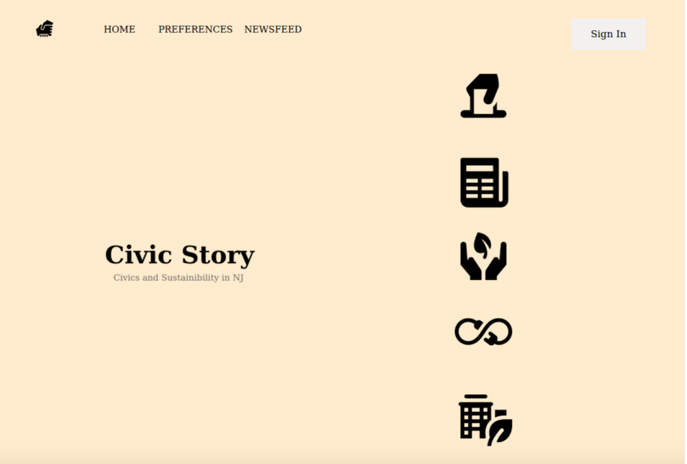
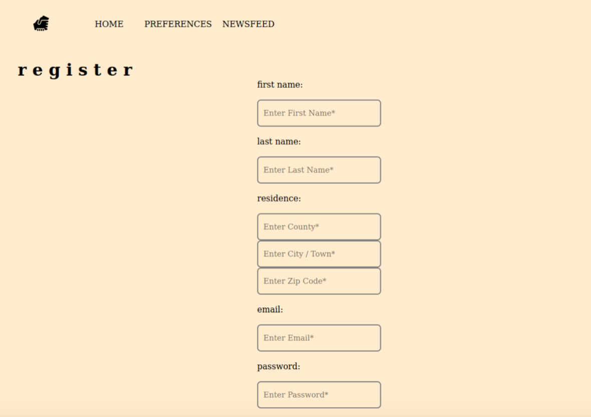
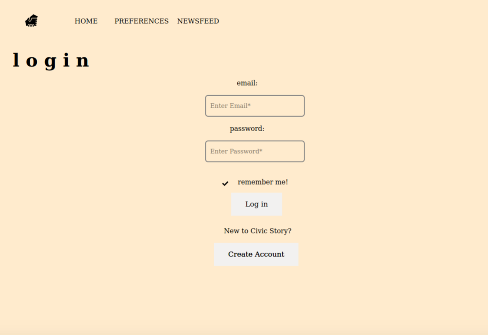
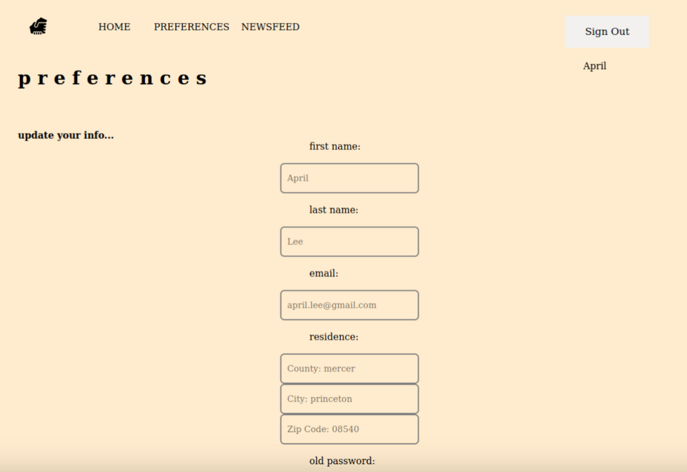
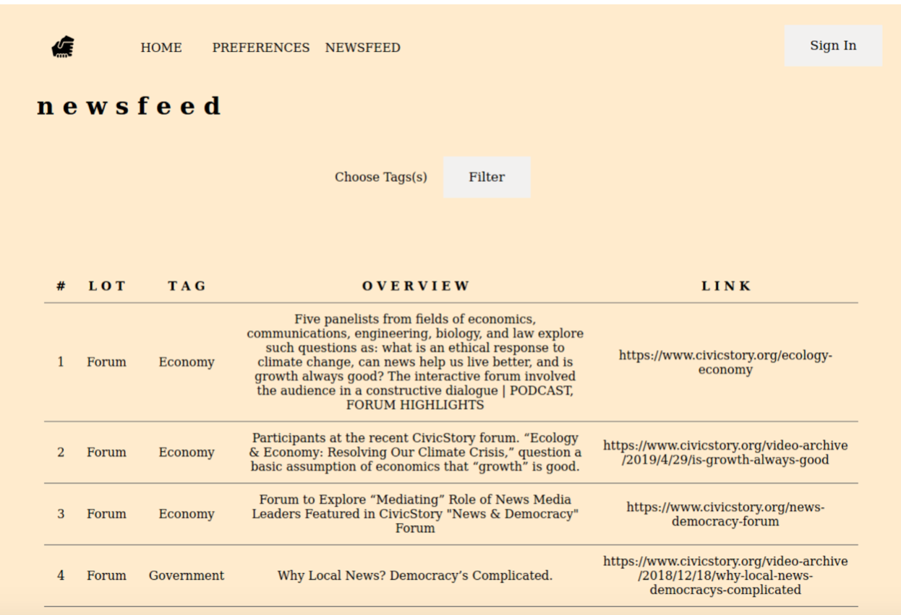

<h1>CSC315-01 Collaborative Project</h1>
<h2>Webpage Alternative to CivicStory</h2> 
Members: Amulya Badineni, Julian De La Cruz, Alhasssane Traore, Adam Mellan

<h3>Project Goal:</h3>
The goal of the project is to allow users to create an account and select specific preferences. By having accounts, the target audience of the website is defined. The content of CivicStory will be then filtered according to a user’s preferences so that they can then get a custom feed that displays media content based on a certain tag. This feature can be enhanced by adding different types of filters.

<h4>How to run:</h4>

This webpage utilizes PostgreSQL, Flask, HTML, and CSS 
1. Download src folder 
2. cd into src folder using the terminal 
3. Run the following commands 
      - sudo apt-get update 
      - sudo apt-get install postgresql-12 
      - sudo apt-get install postgres-psycopg2 
      - sudo apt-get install python2.7 
      - sudo apt-get install python-pip 
      - pip install flask 
4. run:  
      - Sudo postgres -u psql 
      - ALTER USER osc WITH SUPERUSER; 
      - ALTER USER osc WITH CREATEROLE; 
      - ALTER USER osc WITH CREATEDB; 
      - ALTER USER osc PASSWORD ‘osc’; 
      - createdb civicstoryDB 
      - psql civicstory 
      - copy the contents of create-tables.txt into the terminal and press enter 
5. run: python webApp.py 
6. Go to the browser and type use the url: 127.0.0.1:5000 

Home page:

Register page:

Login page:

Preferences page:

Newsfeed page:

